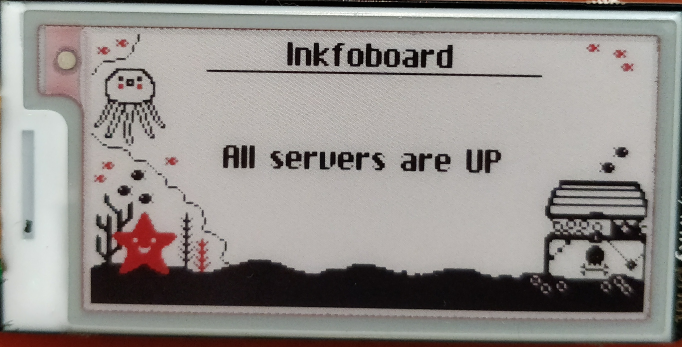
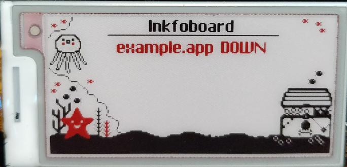
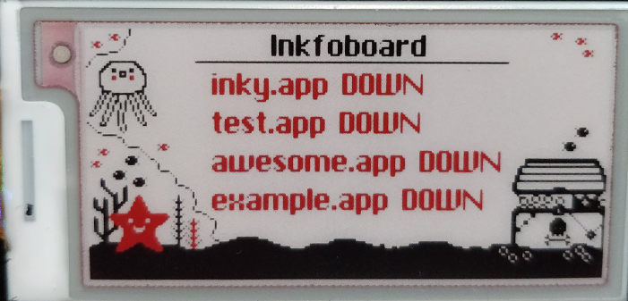
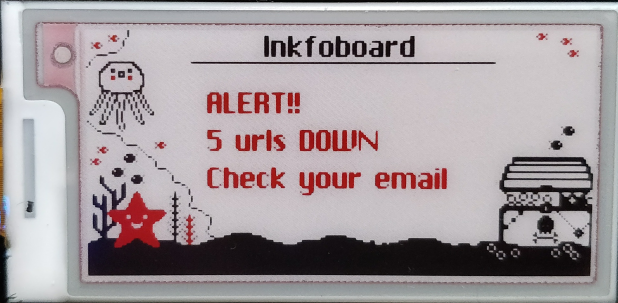
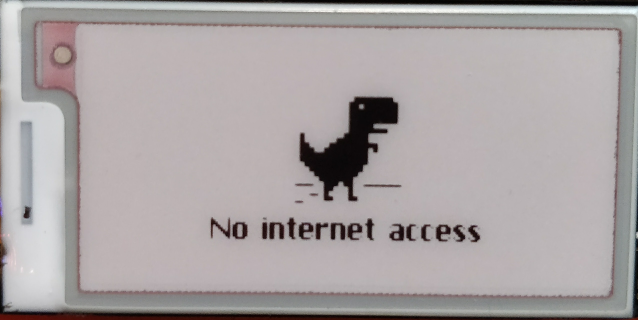

Inkoboard
-------------------
The script will look for all urls in the file you specify or the urls you provide as parameter.
If any url is down an email will be sent to the address provided. If possible, the header of the page will also be sent to you.
Once the site is up another email will be sent to notify the status change.

This is a project to learn a bit of how Pimoroni's [InkyPhat](https://github.com/pimoroni/inky-phat) eink display works so it makes use of it but it is optional.
If the inkyphat option is enabled, the information relating the urls will also be displayed on screen.

The script is set to update the screen just when needed. 
If the status of the urls or the connection doesn't change no updates will be sent to the screen, nor to your email, as ePaper displays do not need refresh to display information.

Screenshots
-------------------
        

Prerequisites
-------------------
Python >= 2.7 (Not tested on Python 3 but it should work)
Pip
Inkyphat package

How to use it
-------------------
Before launching the script you will need to install the inkyphat package.

    $>pip install -r requisites.txt
    $>python monitorink.py [options] urls

**Options:** 
  **-h, --help** Show this help message and exit 
  **-t, --log-response-time** Turn on logging for response times 
  **-r, --alert-on-slow-response** Turn on alerts for response times 
  **--timeout=TIMEOUT** Set the timeout amount (in seconds). 
  **-i, --inkyphat** Enables use of inkyphat. Requires the Inky Phat attached to a RaspberryPi 
  **-o INKYPHAT_ROTATION, --inkyphat-rotation=INKYPHAT_ROTATION** Sets the rotation of the inkyphat, accepted values are 0 or 180. Default is 0 
  **-g, --use-gmail** Send email with Gmail.  Must also specify username and password 
  **--smtp-hostname=SMTP_HOSTNAME** Set the stmp server host. 
  **--smtp-port=SMTP_PORT** Set the smtp server port. 
  **-u SMTP_USERNAME, --smtp-username=SMTP_USERNAME** Set the smtp username. 
  **-p SMTP_PASSWORD, --smtp-password=SMTP_PASSWORD** Set the smtp password. 
  **-s FROM_ADDR, --from-addr=FROM_ADDR** Set the from email. 
  **-d TO_ADDRS, --to-addrs=TO_ADDRS** List of email addresses to send alerts to. 
  **-f FROM_FILE, --from-file=FROM_FILE** Import urls from a text file. Separated by newline. 

**Important notice:** 
If you use the -f parameter, please, make sure you leave an empty line at the end of the file.

Example call: 
`#python monitorink.py -i -o 180 -g -u sender@email.com -p PassWord123 -s sender@email.com -d destination@email.com -f urls.txt -t 15`

Get the best of it when you set a cron job that executes the script every minute. This way all your sites will be monitored at once and you will be notified by email and from the display if anything changes.

    * * * * * python /path/to/monitorink.py [options] urls

----------

**Creative Commons Attribution:** 
https://creativecommons.org/licenses/by/4.0/

ChiKareGo Font was created by Giles Booth 
Taken from http://www.pentacom.jp/pentacom/bitfontmaker2/gallery/?id=3778

The T-Rex was taken from chromium project [source code](https://cs.chromium.org/chromium/src/components/neterror/resources/default_100_percent/offline/100-error-offline.png).
